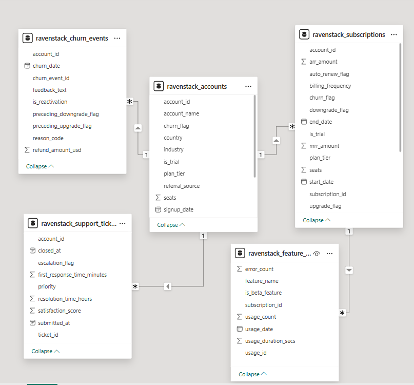
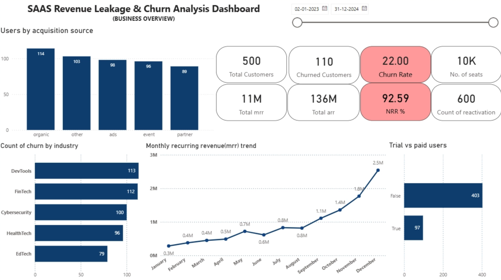
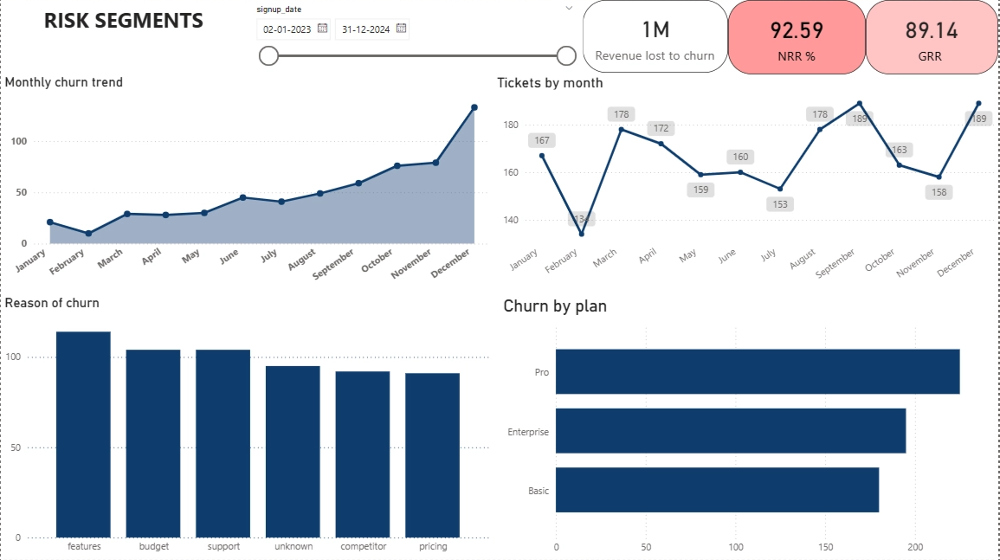

# SAAS Revenue Leakage and Churn Analysis

---

## Project Overview

This project analyzes the data of Ravenstock, a global SaaS company, 
to identify key factors affecting revenue growth and customer retention. 
The dataset includes information on subscriptions, churned users, feature 
usage, and customer support tickets.

The analysis aims to identify patterns in revenue leakage and customer 
churn affecting long-term growth, highlighting risk areas and providing 
data-driven recommendations to improve retention, product adoption, and 
revenue performance.

**The main objectives of this project are:**

- Identify revenue leakage areas by analyzing key SaaS metrics such as 
churn rate, contraction revenue and net revenue retention (NRR)
- Analyze major churn patterns to understand which user segments are more 
likely to leave the platform and the risk areas
- Performed behavioral analysis and feature adoption evaluation to identify 
product usage patterns impacting retention and churn
- Provide actionable insights that can help the company reduce churn, 
improve user engagement, and optimize revenue growth

---

## Dataset Overview

This company's database structure includes multiple tables covering 
accounts, subscriptions, feature usage, churn events and support tickets.

Below is the data model used for analysis:

---

## Executive Summary

After analyzing the SaaS data, it highlights the key revenue leakage 
primarily by high churn rate (~22%) and Net Revenue Retention (~93%) 
below 100%, indicating revenue leakage from churn and contraction. 
Although Enterprise plans contribute major revenue share (~75%) and MRR 
shows overall growth, fluctuations and low feature adoption among churned 
users indicates engagement gaps.

Behavioral analysis indicates that lower product usage and feature adoption 
are major contributors to churn, signaling opportunities to improve product 
adoption and retention strategies.

---

## Key Business Insights

### 1. Net Revenue Retention (NRR) Risk
NRR (~93%) below 100% — a high risk area, indicating revenue lost through 
churn and contractions is higher than the expansion revenue, highlighting 
major revenue leakage potential.

### 2. Revenue Concentration in Higher Tier Plan
Enterprise plans contributes (~75%) of revenue share, indicating high 
product value realization and upsell among higher tier customers. However, 
lower adoption in Basic and Pro plans suggests opportunity to improve 
engagement.

### 3. Customer (Logo) vs Revenue Churn
Logo churn rate (~22%) is higher than revenue churn (~10%), suggesting 
most churned users contribute lower MRR, impacting overall revenue.

### 4. Customer Acquisition
The major source of customer acquisition is organic rather than paid 
events, but fluctuation is seen in signup growth over time, indicating 
major gap in product marketing.

### 5. Feature Adoption and Churn
Feature adoption rate among churned users is less suggesting major reason 
of churn to be features, indicating lower product engagement. This 
contributes in the increase in monthly churn.

### 6. Gross Revenue Retention (GRR)
GRR (~89%) shows loss of revenue due to churn and downgrades exceeding 
the profits from expansion revenue, indicating retention challenges and 
gaps in product market fit.

---

## SQL Queries

| File | Description |
|------|-------------|
| [company_health_01.sql](sql/company_health_01.sql) | Company health metrics |
| [revenue_analysis_02.sql](sql/revenue_analysis_02.sql) | Revenue analysis queries |
| [risk_areas_03.sql](sql/risk_areas_03.sql) | Risk area identification |
| [behavioural_analysis_04.sql](sql/behavioural_analysis_04.sql) | Behavioural analysis |

---

## Dashboard

| File | Description |
|------|-------------|
| [Download Power BI File](dashboard/saas_revenue_dashboard.pbix) | Full dashboard with data |
| [View Dashboard PDF](dashboard/saas_revenue_dashboard.pdf) | View without Power BI |
